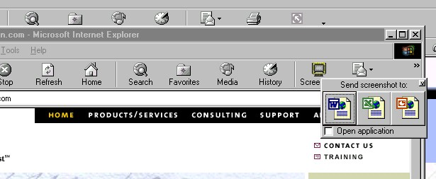



## \[\[\*1aExplorer Screenshot directly to office apps

### Description

Send a screenshot from Internet explorer directly to Word/Excel/Powerpoint in the click of a button.

Great Code. Includes WORD EXCEL and POWERPOINT Automation.VOTE or LEAVE A COMMENT.
 
### More Info
 

             |
---                |---
**Submitted On**   |2002-04-05 18:29:22
**By**             |[Pamela RAI](https://github.com/Planet-Source-Code/PSCIndex/blob/master/ByAuthor/pamela-rai.md)
**Level**          |Advanced
**User Rating**    |4.9 (98 globes from 20 users)
**Compatibility**  |VB 4\.0 \(32\-bit\), VB 5\.0, VB 6\.0
**Category**       |[Complete Applications](https://github.com/Planet-Source-Code/PSCIndex/blob/master/ByCategory/complete-applications__1-27.md)
**World**          |[Visual Basic](https://github.com/Planet-Source-Code/PSCIndex/blob/master/ByWorld/visual-basic.md)
**Archive File**   |[\]\_1aExplor69075452002\.zip](https://github.com/Planet-Source-Code/pamela-rai-1aexplorer-screenshot-directly-to-office-apps__1-33471/archive/master.zip)

